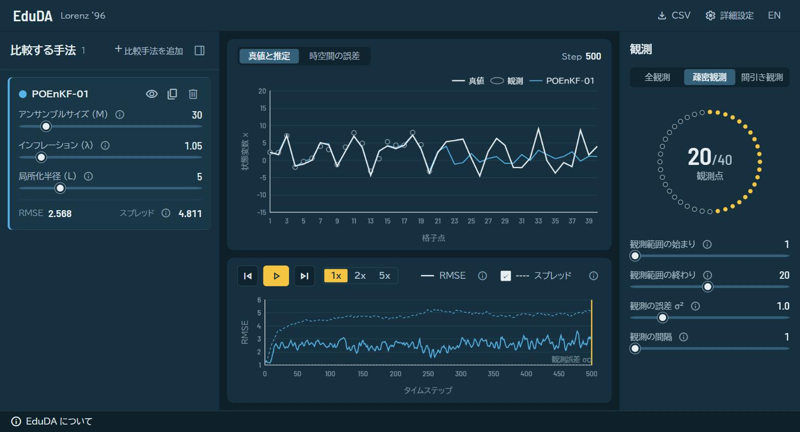

# EduDA — データ同化シミュレータ

**Lorenz '96 カオスモデル上で 7 種類のデータ同化手法を、同一条件でリアルタイムに比較・可視化できる教育用 Web アプリケーション**

### ▶ [eduda.pages.dev](https://eduda.pages.dev/) — インストール不要、ブラウザだけで動きます

[](https://react.dev/)
[](https://vite.dev/)
[](https://www.rust-lang.org/)
[](https://www.chartjs.org/)
[](LICENSE)



> 上のスクリーンショットはプリセット実験 1。インフレーションを入れない POEnKF（青）が 300 ステップ手前からフィルタ発散を起こし、適正なインフレーションを入れた POEnKF（紫）が安定を保っている様子です。

---

## 目次

- [これは何か](#これは何か)
- [主な機能](#主な機能)
- [対応アルゴリズムとパラメータ](#対応アルゴリズムとパラメータ)
- [プリセット実験ラボ](#プリセット実験ラボ)
- [数理モデルと計算仕様](#数理モデルと計算仕様)
- [アーキテクチャ](#アーキテクチャ)
- [開発](#開発)
- [引用](#引用)
- [ライセンス](#ライセンス)

---

## これは何か

**EduDA (Educational Data Assimilation)** は、気象学・海洋学・地球惑星科学や数理科学で不可欠な **データ同化（Data Assimilation）** の挙動を、ブラウザ上で手を動かしながら理解するためのシミュレータです。

データ同化の教科書は数式で手法を説明しますが、「インフレーションを外すと何が起きるのか」「局所化半径を絞るとなぜ精度が上がるのか」は、実際にパラメータを動かして誤差が発散する様子を見るのが一番早い。EduDA はそのための環境です。

標準テストベッドである **Lorenz '96 モデル**（40 変数）を対象に、古典的なカルマンフィルタからアンサンブル手法、変分法、非線形粒子フィルタまで **7 手法を同一の真値・観測条件下で並列実行**し、リアルタイムに比較できます。

<details>
<summary>English</summary>

**EduDA** is an interactive educational web platform for exploring, visualizing and comparing data assimilation algorithms (EKF, POEnKF, EnSRF, LETKF, 3DVar, 4DVar, Particle Filter) on the chaotic Lorenz '96 model. All seven methods run in parallel under identical truth and observation conditions, entirely in the browser — no installation required. Try it at **[eduda.pages.dev](https://eduda.pages.dev/)**.

</details>

---

## 主な機能

**7 手法の同時比較**
EKF / POEnKF / EnSRF / LETKF / 3DVar / 4DVar / 粒子フィルタを、同じ真値・同じ観測から同時に走らせて並べられます。手法ごとにパラメータを個別調整できるため、「同じ手法でパラメータだけ変えた 2 本」を比較する使い方もできます。

**3 つの観測シナリオ**

| モード | 内容 |
| :--- | :--- |
| 全観測 (Full) | 全 40 格子点を毎ステップ観測する基準シナリオ |
| 疎密観測 (Sparse) | 指定した連続領域のみを集中観測。未観測域への誤差共分散の伝播を見る |
| 間引き観測 (Thinned) | 全格子点を空間的に等間隔でサンプリング観測 |

**3 つの可視化モード**

- **時系列プロット** — 同化ステップごとの RMSE とアンサンブル Spread の推移。Error-Spread 関係の良否がひと目で分かります
- **1D 状態空間プロット** — 任意ステップにおける全 40 格子点の真値・観測値・解析値と、アンサンブル信頼区間（±1σ）の重ね合わせ
- **Hovmöller ダイヤグラム** — 時間×空間平面の解析誤差ヒートマップ。カオス波動の伝播と、未観測領域での誤差の蓄積・修正が見えます

**プリセット実験ラボ**
データ同化の重要トピックをワンクリックで再現する 4 つの実験を用意しています（[詳細](#プリセット実験ラボ)）。

**教育用ツールチップ**
各パラメータに数式・物理的意味・推奨値のガイドを表示します。

**CSV エクスポート**
全ステップの真値・観測値・各手法の解析値・RMSE を一括ダウンロード。Python / MATLAB / R での追加解析やレポート作成に使えます。

---

## 対応アルゴリズムとパラメータ

| 手法 | 概要 | 主要パラメータ | デフォルト | 範囲 |
| :--- | :--- | :--- | :--- | :--- |
| **EKF**<br>拡張カルマンフィルタ | 接線線形モデルで共分散を更新。40×40 の共分散行列を明示的に保持する | `processNoise` ($Q$) | `0.01` | 0.001 〜 0.20 |
| **POEnKF**<br>観測摂動型 EnKF | 観測に摂動を加えた確率的モンテカルロ同化 | `ensembleSize` ($M$)<br>`inflation` ($\lambda$)<br>`localization` ($L$) | `30`<br>`1.05`<br>`5` | 5 〜 200<br>1.00 〜 1.50<br>1 〜 20 |
| **EnSRF**<br>アンサンブル平方根フィルタ | 決定論的な観測更新で、観測ノイズのサンプリング誤差を排除 | 同上 | `30`<br>`1.05`<br>`5` | 同上 |
| **LETKF**<br>局所アンサンブル変換 KF | 格子点ごとの局所空間で低次元変換行列を並列計算。現業気象予報の標準手法 | 同上 | `30`<br>`1.05`<br>`5` | 同上 |
| **3DVar**<br>3 次元変分法 | Gaspari-Cohn 相関に基づく静的背景誤差共分散 $B$ による変分同化 | `bgErrorVar` ($\sigma_b^2$)<br>`corrLength` ($L$) | `0.2`<br>`2` | 0.05 〜 3.0<br>0 〜 10 |
| **4DVar**<br>4 次元変分法 | 同化ウィンドウ内の時系列観測を随伴モデルの勾配で同時最適化 | `bgErrorVar` ($\sigma_b^2$)<br>`corrLength` ($L$)<br>`windowSize` ($W$) | `0.05`<br>`2`<br>`6` | 0.02 〜 2.0<br>0 〜 10<br>1 〜 15 |
| **PF**<br>粒子フィルタ | 非ガウス対応フィルタ。標準 SIR と、空間局所化で重み崩壊を抑える LPF を選べる | `filterType`<br>`ensembleSize` ($M$)<br>`localization` ($L$)<br>`resampleThreshold` | `LPF`<br>`30`<br>`3`<br>`0.5` | LPF / SIR<br>10 〜 200<br>1 〜 10<br>0.1 〜 1.0 |

---

## プリセット実験ラボ

画面右上の **「プリセット実験ラボ」** から選ぶと、パラメータが設定済みの比較実験が即座に走ります。各実験は URL で共有できます。

### 実験 1 — インフレーションの効果

`POEnKF (λ=1.00)` vs `POEnKF (λ=1.15)`、いずれも $M=20$, $L=10$ — [試す](https://eduda.pages.dev/?preset=preset1)

有限アンサンブルは共分散を過小評価します。インフレーションがないとアンサンブルが互いに収縮して観測を無視しはじめ、フィルタが発散します。適正なインフレーションを入れると Spread が維持され、安定して同化が続く過程を観察できます（上のスクリーンショットの実行例では平均 RMSE 1.40 vs 0.33）。

### 実験 2 — 局所化の効果

`POEnKF (L=5)` vs `POEnKF (L=20)` — [試す](https://eduda.pages.dev/?preset=preset2)

メンバー数 $M=15$ の少アンサンブルでは、物理的に無関係な遠隔格子点間に偶然の相関（疑似相関）が生じます。局所化半径を絞ってこれをカットすると精度が劇的に向上することを検証します。

### 実験 3 — 固定共分散 vs 流れ依存共分散

`3DVar (静的 B)` vs `LETKF (流れ依存 P)` — [試す](https://eduda.pages.dev/?preset=preset3)

疎密観測下での未観測領域への修正能力の比較です。3DVar が静的な距離減衰修正しかできないのに対し、LETKF はアンサンブルから波の伝播に沿った共分散を動的に推定します。違いは Hovmöller 図で最もよく見えます。

### 実験 4 — 次元の呪いと、局所化による克服

`PF 標準SIR (50 粒子)` vs `PF 局所型LPF (30 粒子, L=3)` — [試す](https://eduda.pages.dev/?preset=preset4)

40 変数の高次元空間では、標準的な SIR 粒子フィルタは尤度が特定の 1 粒子に集中して崩壊します（重みの崩壊）。一方、空間局所化を導入した LPF は、より少ない粒子数でも崩壊を回避できます。粒子数を増やすことではなく局所化が鍵である、という点が体感できます。

---

## 数理モデルと計算仕様

### Lorenz '96

Edward Lorenz (1996) による 1 次元大気波動のトイモデルを支配方程式に採用しています。

$$\frac{dx_j}{dt} = (x_{j+1} - x_{j-2}) x_{j-1} - x_j + F \quad (j = 1, \dots, N)$$

- **格子点数** $N = 40$、**外力項** $F = 8.0$（$F \ge 8$ で強いカオス的挙動）
- **周期境界条件** $x_{-1} = x_{N-1}, \; x_0 = x_N, \; x_{N+1} = x_1$
- **数値積分** 4 次ルンゲ＝クッタ法、$dt = 0.05$（大気時間で約 6 時間に相当）

### スピンアップとバーンイン除外

- **スピンアップ** — 真値は事前に 1,000 ステップ積分し、Lorenz '96 アトラクター上に乗せた状態から開始します。初期値の偏りを排除するためです
- **バーンイン除外** — 同化開始直後の過渡応答（最初の 20% のステップ）を自動的に除外し、定常状態のみで平均性能指標（Avg RMSE / Avg Spread）を算出します

---

## アーキテクチャ

```
UI Layer — React 19 + Chart.js + Canvas 2D
  ├── TopNav             ヘッダー / プリセット選択 / 言語切替
  ├── ObsTabs            観測モード切り替え
  ├── ControlPanel       手法の追加・パラメータ調整・実行・CSV 出力
  ├── MethodCard         手法ごとのカードとスライダー
  └── VisualizationArea  時系列 / 1D プロット / Hovmöller

Compute Layer — Web Worker (src/workers/daWorker.js)
  ├── Rust → WebAssembly (crates/eduda_wasm)   ← 主計算経路
  │     l96.rs, math.rs, methods/{ekf,enkf,ensrf,letkf,var3d,var4d,pf}.rs
  └── JavaScript 実装                           ← WASM 読み込み失敗時のフォールバック
```

**計算は Rust/WASM、UI はメインスレッド**
7 手法すべてが Rust で実装され、WebAssembly にコンパイルされています。アンサンブルシミュレーションや随伴モデルの勾配計算はすべて Web Worker 上の WASM で実行されるため、UI の描画や操作性を阻害しません。WASM の読み込みに失敗した場合は、同等の JavaScript 実装に自動でフォールバックします。

**Hovmöller の描画**
Offscreen Canvas の `ImageData` バッファに直接ピクセルを書き込むことで、数千ステップ × 40 格子のヒートマップを滑らかに描画しています。

---

## 開発

### 必要要件

- **Node.js** `^20.19.0 || >=22.12.0`（Vite 8 の要件）
- **npm** v10 以上
- **Rust**（任意）— WASM を再ビルドする場合のみ

### セットアップ

```bash
git clone https://github.com/fulltomo/EduDA.git
cd EduDA
npm install
npm run dev        # http://localhost:5173
```

### スクリプト

| コマンド | 内容 |
| :--- | :--- |
| `npm run dev` | Vite 開発サーバーを起動 |
| `npm run build` | WASM をビルドしてから本番ビルド |
| `npm run preview` | ビルド成果物をローカルで配信 |
| `npm run lint` | Oxlint による静的解析 |

### WASM のビルドについて

ビルド済みの `.wasm` はリポジトリにコミットされているため、**Rust をインストールしていなくても `npm run build` は通ります**（WASM ビルドを自動でスキップします）。

Rust コードを変更して再ビルドする場合は、WASM ターゲットを追加してください。

```bash
rustup target add wasm32-unknown-unknown
npm run build
```

### CI

[`.github/workflows/ci.yml`](.github/workflows/ci.yml) が `main` への push と Pull Request で `npm run lint` と `npm run build` を実行します。

---

## 引用

研究や教材で利用された場合は、[`CITATION.cff`](CITATION.cff) の情報でご引用ください。GitHub のリポジトリページ右側「Cite this repository」から APA / BibTeX 形式で取得できます。

```
Tomono, Tomoki. EduDA: Educational Data Assimilation Platform with Lorenz '96.
https://github.com/fulltomo/EduDA
```

---

## ライセンス

[MIT License](LICENSE) のもとで公開しています。教育・研究・商用を問わず自由にご利用いただけます。
